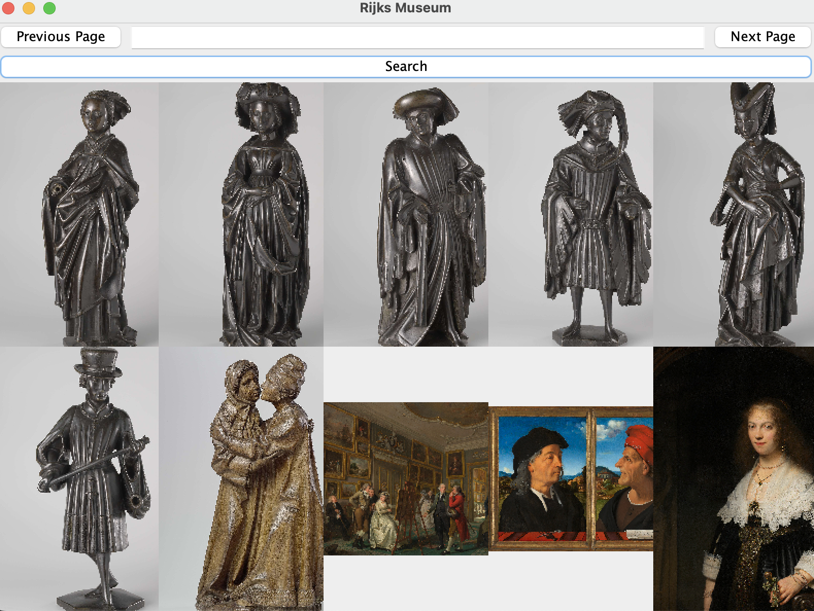

# RIJKS API
This program retrieves object metadata from the Rijksmuseum API, 
allowing users to search the collection based on criteria 
like artist or material. 
It then displays the images requested.
